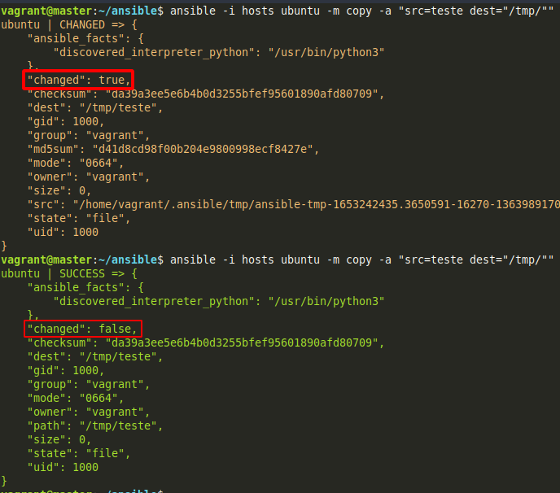
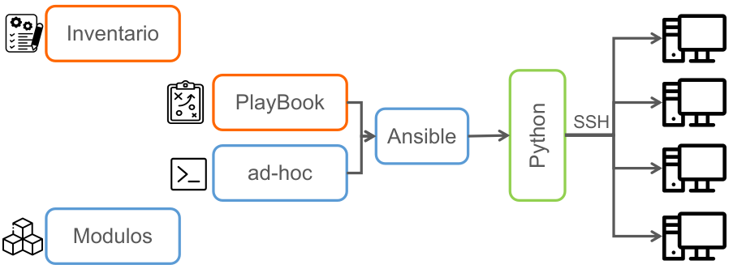

# Ansible - Udemy

## Seção 1: Introdução

1. Introdução ao Ansible
    - Introdução ao que aprenderemos durante o curso, comandos e conceitos sobre o Ansible.
    - Repositório do curso <https://gitlab.com/treinamentos1/ansible>
    - O que é o Ansible: Uma ferramenta de automação e gerenciamento de configurações. 
    - Porque o Ansible:
        - É livre e de código aberto;
        - Curva rápida de aprendizado;
        - Automatização em menos tempo;
        - Entrega completa em minutos;
        - Gerenciamento simples;
        - Sem necessidade de agentes (SSH);
        - Indempotência:
            - É a propriedade que algumas operações têm de poderem ser aplicadas várias vezes sem que o valor do resultado se altere após a aplicação inicial. Em resumo, será executado apenas se houver necessidade.
            
    - Administração do Ansible:
    
        - Arquivos:
            - **Inventário:**  Arquivo que descreve as máquinas a serem acessadas pelo Ansible e suas particularidades.
            - **Modulos:** pequenos programas utilizados para realizar tarefas de automação no nó destino.
            - **Playbooks:** UM arquivo escrito em linguagem YAML com configuração simples, reutilizável e repetível.
            - **ad-hoc:** Quando utilizamos o Ansible para uma tarefa única, por exemplo: desligar, reiniciar, enviar um arquivo, inserimos um módulo diretamente da linha de comando. Já para comandos mais complexos, é necessário usar um Ansible Playbook.

## Seção 2: Criando laboratório

2. Instalação das ferramentas
    - Como utilizo Windows, tentarei reproduzir o laboratório totalmente em nuvem, instalei um Debian para ser servidor do Ansible, e irei instalar VMs lá para dar continuidade. Optei por ser assim porque não tem Ansible para Windows.
    - Virtualbox -> OK
    - Visual Code -> OK
    - Vagrant -> OK
    - Git -> OK
    - Ansible -> OK

3. Criando máquinas virtuais
    - Criei 4 vms no GCP, 2 com Ubuntu e 2 com centOS

4. Formas de acessar as VMs
    - Nesta aula o instrutor deu algumas dicas com a utilização do vagrant para laboratório em Virtualbox

5. Instalação do Ansible
    - Utilização do Ubuntu como server do Ansible

6. Criar o arquivo de inventário personalizado
    - Criando um arquivo dentro do server
    - `ansible -i hosts IP -k -m ping`
    - (A sessão ssh de uma VM para outra dura apenas 5 min)

7. Melhorando o arquivo de inventário
    - Adicionando nome aos servidores
    - `NOMEMAQUINA ansible_ssh_host=IPMAQUINA`
    - Adicionando um grupo de servidores
    - ```
        [GRUPO]
        SERVIDORES
      ```
    - Adicionando subgrupos de servidores
    - ```
        [GRUPO:children]
        SUBGRUPO1
        SUBGRUPO2
      ```
    - Adicionando usuário e senha para servidores
    - ```
        [GRUPO:vars]
        ansible_ssh_user=USUARIO ansible_ssh_pass=SENHA
      ```

8. Criando chave ssh e configurando
    - Adicionando chave privada no arquivo de configuração do ansible
    - `private_key_file=CAMINHODOARQUIVO`
    
9. Transferindo o Inventário para o arquivo padrão
    - No inicio do curso foi criado um arquivo com o nome `hosts`.
    - Nesse vídeo o instrutor mostra como colocar no arquivo padrão do ansible sem colocar o `-i ARQUIVO`, porém na instalação do Ansible não colocou os arquivos padrões que normalmente ficam em `/etc/ansible/`.

## Ad-hoc

10. Ad-hoc
    - O que significa Ad-hoc: Ad hoc significa “para esta finalidade", “para isso” ou "para este efeito". É uma expressão latina, geralmente usada para informar que determinado acontecimento tem caráter temporário e que se destina para aquele fim específico.
    - Um exame ad hoc, um método ad hoc, um cargo ou uma função ad hoc, são exemplos que definem a criação de algo provisório, que vai atender apenas determinado propósito.
    - ADHOC no Ansible, São comandos executados diretamente na linha de comando com a instrução que deseja, vamos supor que você precise dar um start/stop/restart em um serviço em uma série de servidores, ou você precise saber quais servidores estão com a configuração X, ou ver espaço em disco, memória, ou talvez você queira instalar um pacote, enfim são N possibilidades, mais você só quer fazer isso em um dado momento e não necessariamente guardar essa configuração em playbook.
    
        Parametro   | Descrição
        ---------   |---------
        -i          | Apresentar a localização do inventário
        -u          | Apresentar o usuário que executará o comando
        -k          | Solicitar a senha do usuário.
        -m          | Módulo que será utilizado.
        -b          | Substituir para o usuário root caso precisar.
        -a          | argumento do módulo.

## Conhecendo módulos com o comando Ad-hoc

11. Introdução aos módulos
    - São utilizados para rodar comandos especificos nas máquinas
    - Site com todos os módulos do Ansible <https://docs.ansible.com/ansible/2.9/modules/modules_by_category.html>

12. Módulo - Shell
    - Executando um teste com os comandos shell `chdir` e `create`
    - `ansible -i hosts host-ubuntu -m shell -a "chdir=/tmp touch exemplo1.txt"` *Mudar de diretório e criar um arquivo*
    - `ansible -i hosts host-ubuntu -m shell -a "chdir=/tmp creates=exemplo1.txt touch exemplo2.txt"` *Só criar o arquivo 2 se o 1 não existir*

13. Módulo - Copy
    - Módulo para copiar arquivos
    - `ansible -i hosts host-ubuntu -m copy -a "src=teste.txt dest=/tmp"` *copiando um arquivo de um local para outro*
    - `ansible -i hosts host-ubuntu -m copy -a "src=teste.txt dest=/tmp mode='u=rwx,g=r,o=r'"` *concedendo permissões especificas*
    - `ansible -i hosts host-ubuntu -m copy -a "src=teste.txt dest=/tmp mode=742"` *mesmo exemplo, porém utilizando permissionamento com número*
    - `ansible -b -i hosts host-ubuntu -m copy -a "src=teste.txt dest=/tmp group=root owner=root"` *alterando o grupo e dono do arquivo*

14. Módulos Apt, Yum e Package
    - Instalando pacotes em distribuições debian
    - `ansible -i hosts host-ubuntu -b -m apt -a "name=cmatrix state=present update_cache=yes"` *instalando o pacote `cmatrix` e atualizado o apt*
    - `ansible -i hosts host-ubuntu -b -m apt -a "name=cmatrix state=absent"` *Removendo um pacote*
    - `ansible -i hosts host-centos -b -m yum -a "name=telnet state=present"` *instalando um pacote em S.O rpm*
    - `ansible -i hosts host-centos -b -m yum -a "name=telnet state=absent"` *removendo pacote pelo yum*
    - `ansible -i hosts host-centos -b -m package -a "name=telnet state=present"` *instalando com o módulo package para sistemas genéricos onde o ansible "descobre" qual é o sistema e instala com o mais adequado*

15. Módulo setup, coletando facts
    - facts são informações sobre o sistema operacional
    - `ansible -i hosts host-ubuntu -m setup` *trazendo todas as informações sobre o sistema operacional*
    - `ansible -i hosts host-ubuntu -m setup -a "filter=ansible_distribution"` *filtrando informações com o argumente `filter`*

16. Módulo Git
    - `ansible -i hosts host-ubuntu -m git -a "repo=https://github.com/ansible/ansible-examples.git dest=/tmp/ansible-examples"` *Fazendo clone de um repositório em um destino especifico*
    - `ansible -i hosts host-ubuntu -m git -a "repo=https://github.com/ansible/ansible-examples.git dest=/tmp/ansible-examples version=festdemo"` *indicando a branch que será utilizada*

17. Módulo uri
    - Testando urls
    - `ansible localhost -m uri -a "url=https://http.cat/ status_code=200"` *testando status 200*
    - `ansible localhost -m uri -a "url=https://http.cat/ status_code=301"` *testando outro status e dando falha na execução*
    - `ansible localhost -m uri -a "url=https://http.cat/ status_code=301" | grep -i "failed" | wc -l` *comando para contar quantas vezes deu "erro" nas páginas (extra)*
    - `ansible localhost -m uri -a "url=https://http.cat/ status_code=200 return_content=yes"` *argumente `return_content` para trazer o corpo do site*

18. Módulo filesystem
    - Concede um tipo de filesystem a um disco
    - `ansible -b -i hosts host-ubuntu -m filesystem -a "fstype=ext4 dev=/dev/sdb"` *formando um disco remoto em ext4*
    - `ansible -b -i hosts host-ubuntu -m filesystem -a "fstype=ext3 dev=/dev/sdb force=yes"` *sobrescrevendo com o argumento `force`*

19. Módulo mount
    - Módulo para montagem de discos
    - `ansible -b -i hosts host-ubuntu -m mount -a "src=/dev/sdb path=/mnt fstype=ext3 state=mounted opts=rw,auto"` *montando a partição que criamos anteriormente utilizando vários argumentos*

20. Módulo at e cron
    - Módulo at agenda a execução de um script ou comando
    - `ansible -i hosts host-ubuntu -m at -a "command='echo ola > /tmp/ola.txt' count=1 units=minutes"` *executando um comando após 1 minuto*
    - Módulo cron para agendar no crontab
    - `ansible -b -i hosts host-ubuntu -m cron -a "name='agendar upgrade' hour=1 user=root job='apt update && apt upgrade'"` *agendando uma tarefa ao crontab*

21. Módulo service
    - Módulo para configurar serviços do S.O.
    - `ansible -b -i hosts host-ubuntu -m service -a "name=sshd state=restarted enabled=yes"` *realizando um restart do serviço do ssh*

22. Módulo timezone
    - Módulo para configuração do timezone
    - `ansible -i hosts host-ubuntu -b -m timezone -a "name=America/Sao_Paulo"` *alterando o timezone*

## Primeiro Playbook

23. Sintaxe Yaml
    - Explicado como é criado um arquivo YAML e como ele é utilizado.

24. Instalando e habilitando o Nginx
    - Vamos criar nosso primeiro playbook
    - Resumo:
        - Instalar o Nginx garantindo que está ativo e iniciando com o sistema
        - Garantir que o arquivo de configuração do Nginx esteja integro e fazer o deploy de uma página
        - Aprender a criar template baseado em variaveis dos facts, retornamos pelo módulo setup
        - Fazer o deploy do template

25. Deploy do index e garantindo integridade das configurações
    - Continuação do playbook iniciado na aula anterior.

26. Handlers
    - Melhorando playbook criado anteriormente
    - Tomar cuidado, o Ansible é case sentive o mesmo nome dado ao `notify` precisa ser dado ao `handler`

27. Executando vários Handlers
    - Melhorando playbook criado anteriormente, utilizando vários Handlers

28. Criando templates
    - Utilizando template com arquivo de extensão `.j2` trazendo facts do servidor

## Variáveis em Playbooks

29. Introdução as váriaveis
    - Verificando váriaveis válidas e não válidas

30. Váriaveis dentro do playbook
    - Criando novo playbook
    - mostrando em tela váriaveis decladas

31. Alterando váriaveis via linha de comando
    - `ansible-playbook playbook.yaml -e username=morpheus` *comando para declarar váriaveis via linha de comando do Ansible*

32. Váriaveis no diretório host_vars
    - criando um diretorio `host_vars` e declarando váriaveis

33. Declarar facts no playbook
    - 